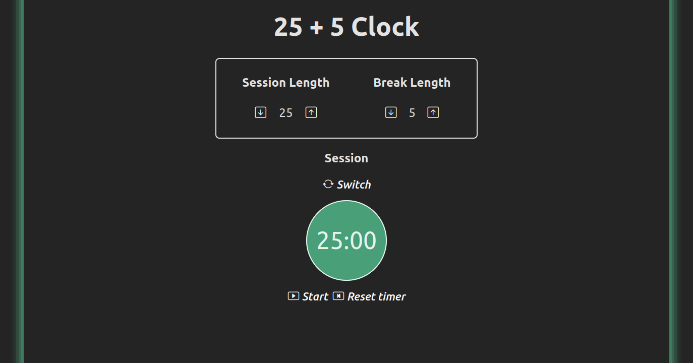
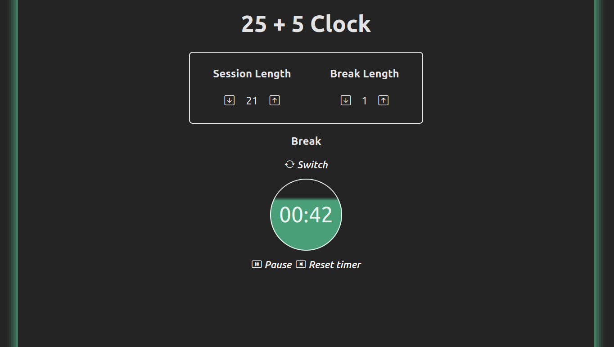
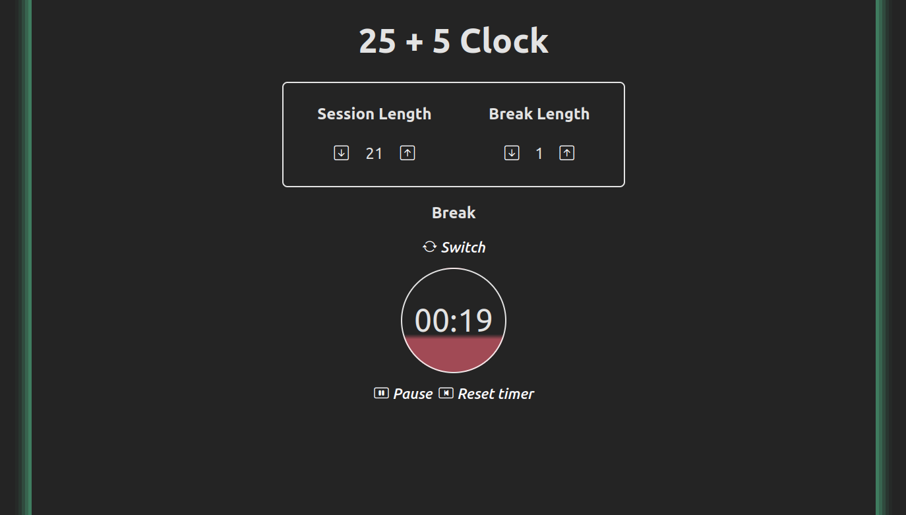

# fcc-25-5-clock
A 25 + 5 Clock I made as a freeCodeCamp [project](https://www.freecodecamp.org/learn/front-end-development-libraries/front-end-development-libraries-projects/build-a-25--5-clock) [updated](https://github.com/freeCodeCamp/freeCodeCamp/issues/45922) for [Front End Development Libraries](https://www.freecodecamp.org/learn/front-end-development-libraries) module.

[Live Demo](https://a-sortan.github.io/fcc-25-5-clock/)

